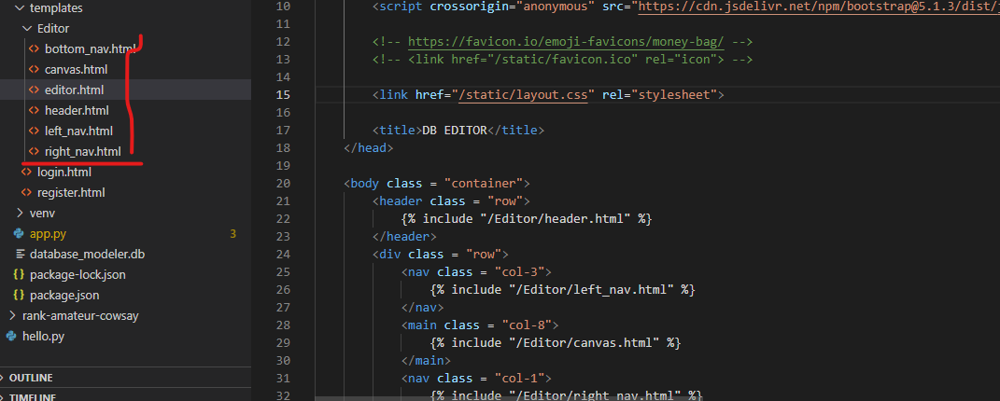
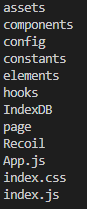
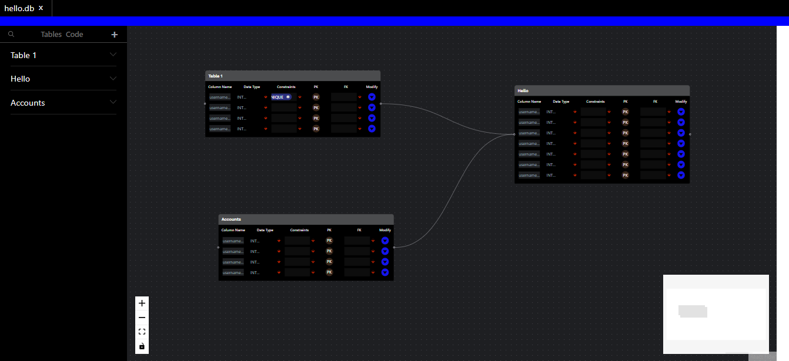

# cs50_final
A browser based database modeler

# Browser Based Database Modeler

<h1>THE INSPIRATION:</h1>

  Initially, I tried to design a website that can help people find and compare the best phone plans from all over the web, and more importantly, all over the globe. As someone who recently returned from a trip abroad, I had to deal with the struggle of comparing phone plans from tons of random websites. I wanted a single source of truth: an aggregate site that can compare plans anywhere. However, I knew that this would require intense planning. During the planning I became thoroughly stumped. I wanted to design a complex database for the site, but the tools were too restrictive. 

  I came across dbdiagram.io and I thought it was perfect, but it did not allow edits through the UI. Instead, all edits had to be made in a variation of SQL that I did not fully understand. I thought it was odd that I could not edit the diagram directly.

  I also looked at Lucid Charts, which was heavily recommended by referral boards, but it did not offer any database specific features. Eventually, I tried downloading some fairly old software that ran on my laptop, but I found it clunky and visually unappealing.

  I thought it was odd that every solution I found was either overpriced, not meant for databases, or inaccessible because of poor or overcomplicated UIs. In the end, I was so frustrated, I designed my data model in Google Sheets.

  I was so frustrated with the process that I decided to build my own modeler

<h1>THE APPROACH:</h1>

  I started off the project by searching for open source designs to use as inspiration.
  After looking over several possible options, I found <a href = "https://www.figma.com/community/file/953392126753792320">this design</a> by Adam Itler on Figma's 
  community board.

  Once I had a design figured out. I decided to try to implement a basic version in Jinja and Flask, but I found the process overwhelming. 

  

  I had tried to create a complete Editor, but embedding every single component inside each other became unweildly. Although it meant abandoning my progress, I needed a better way.

  I spent hours looking through articles and tutorials, hoping that something would offer insight.

<h3>Articles I checked</h3>
<ul>

  <li>
    <h5>
      <a href = "https://medium.com/@tom.humph/creating-an-infinite-whiteboard-97527e886712">
        Creating an infinite whiteboard
      </a>
    </h5>
  </li>

  <li>
    <h5>
      <a href = "https://www.youtube.com/watch?v=7PYvx8u_9Sk">
        Canvas Drag & Drop Objects Tutorial | HTML5 Canvas JavaScript Tutorial [#10]
      </a>
    </h5>
  </li>

  <li>
    <h5>
      <a href = "https://www.youtube.com/watch?v=gm1QtePAYTM&ab_channel=TraversyMedia">
        HTML5 Canvas API Crash Course
      </a>
    </h5>
  </li>

  <li>
    <h5>
      <a href = "https://www.youtube.com/watch?v=Yvz_axxWG4Y&t=183s&ab_channel=Frankslaboratory">
        HTML5 Canvas CRASH COURSE for Beginners
      </a>
    </h5>
  </li>
  
  <li>
    <h5>
      <a href = "https://github.com/dilidili/react-canvas-infinite" >
        react-canvas-infinite
      </a>
    </h5>
  </li>

  <li>
    <h5>
      <a href = "https://github.com/mathieuguyot/oura-node-editor" >
        oura-node-editor
      </a>
    </h5>
  </li>
  
  <li>
    <h5>
      ETC.
    </h5>
  </li>
</ul>

  Eventually, I came across <a href = "https://reactflow.dev/showcase/">React-Flow</a>. I knew about React, but I had been extremely rusty and have never built any projects with it. However, the showcase from React-Flow proved that it was exactly what I was looking for. It was well maintained an documented, and used to create data models with adjacent use cases to my own. Unfortunately, this meant an unbearable sprint to learn on the needed technologies: React and Recoil. Confessionally, I had wanted to learn React for a long time, so I saw this as a way to justify something I had been putting off for a long time. 

  Starting with a <a href = "https://www.youtube.com/watch?v=4UZrsTqkcW4&ab_channel=freeCodeCamp.org">Freecode camp video</a> at 2x speed, and a shameful amount of note taking, I felt somewhat comfortable to approach the problem. In the end, I probably spent 65+ hours on this project (this might be an underestimate). However, by leveraging Medium articles, Reddit, StackOverflow, YouTube, and the hundreds of online resource available, I was able to confront the issue. There were a lot of needless roadblocks. I spent time trying to learn IndexDB before realizing that it was a lost cause. I spent a few hours looking over Redux after realizing my code became unreasonably convoluted, but I ended dropping my research to learn the Facebook backed Recoil State Management software. 

  I actually scrapped my code twice while working on it. In hindsight, it might have been wiser to stick with Jinja. The final code structure I had was heavily based on the recommendation of <a href = "https://blog.webdevsimplified.com/2022-07/react-folder-structure/">Web Dev Simplified</a>, a fairly well known software influencer. 

  This is the final iteration of my code. I will remove the IndexDB folder, as it's mostly convoluted code that was leftover from before I understood state management. 

  After this (regretful) mad sprint, I was able to achieve 2/5s of my ambitions. I can move tables around on an infinite canvas. They are bit buggy. Menus don't always close as expected and the navigation features are only semi-functional, but I could use it to model a database and it looked better than many of the alternatives out there. I'm certain if I were to continue to work on it, I could make it that it auto creates SQL based on the diagram. It could become a robust solution for the problem I confronted early on in my project: database design. Even if it's not what I wanted it to be, I'm proud of it.

  It's deployed simply using a bare bones Flask app. In the future, I plan on implementing a full on login page and user accounts. Still, I'm impressed by how much I was able to do, especially knowing my own limitations from the start.

<h3>Technologies used</h3>
<ul>
    <li>
        React: front-end web framework
    </li>
    <li>
      JavaScript: programming language for web development
    </li>
    <li>
      Visual Studio Code: code editor
    </li>
    <li>
      React-Flow: front-end library for creating drag and drop nodes
    </li>
    <li>
      Recoil: state management library
    </li>
    <li>
      postgreSQL/MySQL: I used their documentation to help define parameters for the database modeler
    </li>
    <li>
      Flask/Jinja: I used them to  deploy the website locally and make a partially finished login page, though I have not included the latter because it still needs too much work.
    </li>
    <li>
      IndexDB: an in browser database modeler. I never ended up using it, but I spent a considerable amount of time researching it and attempting to work with it before moving on.
    </li>
    <li>
      Redux: like IndexDB, I put in considerable amount of time to understand the library, but ultimately, I found it too complex and decided to learn the much simpler Recoil instead.
    </li>
    <li>
      HTML Canvas: Canvas is very hard to use, which is why I ultimately abandoned all my efforts to use it. Nonetheless, I spent a large porition of my time trying to leverage it to make movable database nodes.
</ul>

<h3>How to use the code</h3>
<ul>
    <li>
        After Cloning, go to Figma Design and right click on the white space. This will bring up the options menu.
    </li>
    <li>
        Go to Plugins -> Development -> Deploy - Import Plugin from Manifest
        
    </li>
    <li>
      Select the manifest file from the cloned repository.
    </li>
</ul>
