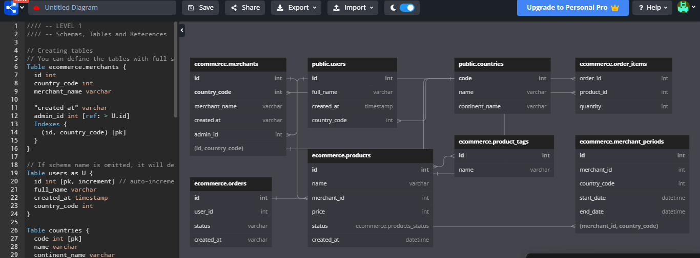
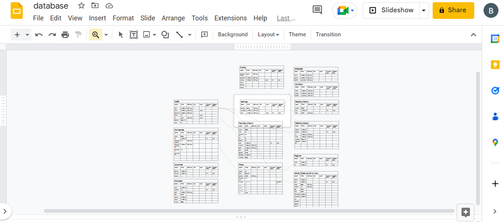
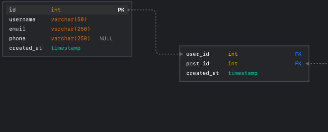

# cs50_final
A browser based database modeler

# Browser Based Database Modeler

<h1>THE INSPIRATION:</h1>

  Initially, I tried to design a website that can help people find and compare the best phone plans from all over the web, and more importantly, all over the globe. As someone who recently returned from a trip abroad, I had to deal with the struggle of comparing phone plans from tons of random websites. I wanted a single source of truth: an aggregate site that can compare plans anywhere. However, I knew that this would require intense planning. During the planning I became thoroughly stumped. I wanted to design a complex database for the site, but the tools were too restrictive. 

  I came across dbdiagram.io and I thought it was perfect, but it did not allow edits through the UI. Instead, all edits had to be made in a variation of SQL that I did not fully understand. I thought it was odd that I could not edit the diagram directly.

  I also looked at Lucid Charts, which was heavily recommended by referral boards, but it did not offer any database specific features. Eventually, I tried downloading some fairly old software that ran on my laptop, but I found it clunky and visually unappealing.

  I thought it was odd that every solution I found was either overpriced, not meant for databases, or inaccessible because of poor or overcomplicated UIs. In the end, I was so frustrated, I designed my data model in Google Sheets.

  I was so frustrated with the process that I decided to build my own modeler

<h1>THE APPROACH:</h1>

  I started off the project by searching for open source designs to use as inspiration.
  After looking over several possible options, I found <a href = "https://www.figma.com/community/file/953392126753792320">this design</a> by Adam Itler on Figma's 
  community board.

  Once I had a design figured out. I decided to try to implement a basic version in Jinja and Flask, but I found the process overwhelming.

<h3>Technologies used</h3>
<ul>
    <li>
        React-Related
        <ul>
          <li>
            React
          </li>
          <li>
            Material UI
          </li>
          <li>
            Custom React Hooks
          </li>
          <li>
            Redux
          </li>
        </ul>
    </li>
    <li>
      WebPack
    </li>
    <li>
      TypeScript
    </li>
    <li>
      SQL
    </li>
    <li>
      Figma Design
    </li>
    <li>
      Figma API
    </li>
    <li>
      Shared Web-Workers
    </li>
</ul>

<h3>How to use</h3>
<ul>
    <li>
        After Cloning, go to Figma Design and right click on the white space. This will bring up the options menu.
    </li>
    <li>
        Go to Plugins -> Development -> Deploy - Import Plugin from Manifest
        
    </li>
    <li>
      Select the manifest file from the cloned repository.
    </li>
</ul>
