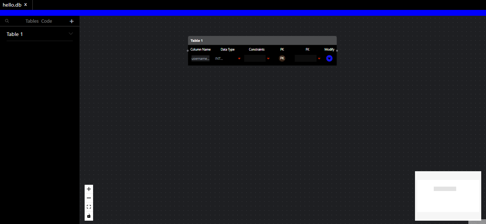
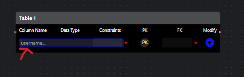
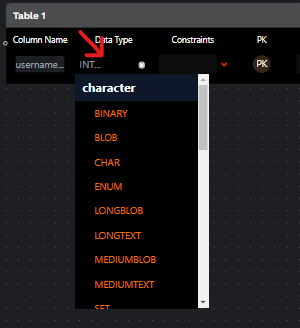
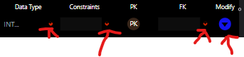
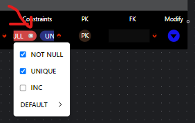
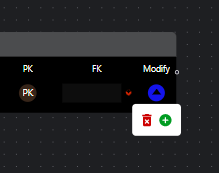
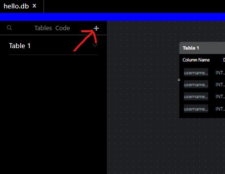
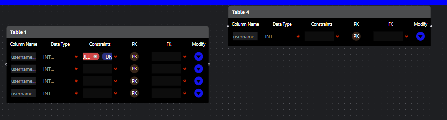
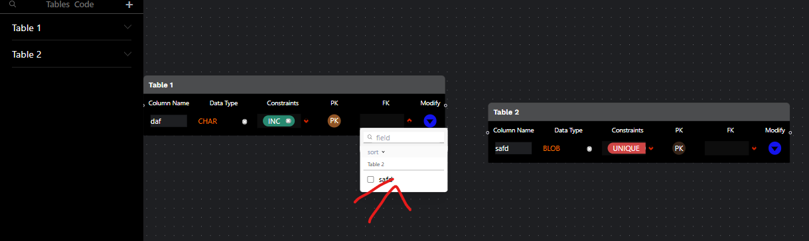
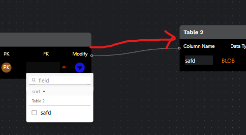

# cs50_final
A browser based database modeler

# Browser Based Database Modeler

<h2>What the code does</h2>

    It's a browser based application that allows users to build database models, so they can see how their data is structured before they invest anytime in building their apps. <a href = "https://stupendous-sundae-02f5cd.netlify.app">DEMO</a>.
    <strong><a href= "https://www.loom.com/share/8810842a5e94408ba8cfd2f18c955210">Video</a></strong>

<h2>How does the code work?</h2>

    The code is a react application that leverages Recoil for state management, React-Flow for dragging and wireframing capabilities, and Tailwind CSS for styling and design.

<h2>Use and deployment</h2>
<h3>Base technologies for deployment</h3>
<ul>
    <li><a href = "https://nodejs.org/en/download/">A version of Node.JS greater than 17+</a></li>
    <li>Node Package Manager (npm) installed</li>
    <li>Git installed locally</li>
</ul>
<h3>How to deploy for development</h3>
<ul>
    <li>Using GIT, clone the repository with the following URL https://github.com/TheOtherBrian1/cs50_final</li>
    <li>Once the repository is cloned, go into the App directory using the terminal</li>
    <li>In the terminal, enter <em>npm install</em>. This will install all the dependencies outlined in the package.json</li>
    <li>Once all the dependencies are downloaded, run <em>npm start</em> to deploy Create-React-Apps built in development server. Once it's deployed, it will tell you which localhost port to use to see the app.
    </li>
</ul>
<h3>How to use the app</h3>
<ul>
    <li>
        
        Once the website loads, you'll see an open screen with a table model in the middle. You can pan, zoom in and out, and drag the diagram around the canvas.
    </li>
    <li>
        
        If you click on the title of the table diagram (should default to Table 1), you should be able to change it. These changes should reflect on the left hand menu of the website.
    </li>
    <li>
        
        By clicking on the column name input box, you should be able to rename the column.
    </li>
    <li>
        
    </li>
    <li>
        
        By clicking on the "Data Type" input, you can select a data type for your column. You can even filter the options by typing. <strong>NOTE:</strong> the only way to close the box is by clicking on the pop up (x) button or by selecting a data type.
    </li>
    <li>
        
        There are several toggles for each column. The dropdown will not go away when you click away. The only way to close them is by clicking on the dropdown icons.
    </li>
    <li>
        
        You can select multiple constraints for your columns. Although it may not appear as if the constraints have been applied, the constraint input is scrollable. You can use it to see all your constraints.
    </li>
    <li>
        
        By clicking on the modify button, you will be given the option to add or remove columns. If you accidentally remove all the columns of a table, there is no way to restore them. You will unfortunately have to restart the website in this case.
    </li>
    <li>
        
        You can create more tables by clicking on the plus button in the left hand menu. Although it may not appear as if you created a new table, you did. The tables will spawn in the same spot, so some may be hidden behind each other. Move them around to reveal all the tables.
    </li>
    <li>
        
        Once you have multiple tables, you can begin to position them next to each other to establish relationships. If you officialize a relationship by using the <strong>FK (foreign key)</strong> dropdown, you should know that it has a few bugs. 
        
        The app will crash if you try to use it when there are no named columns or only one table in existence. In these cases, you must restart the app.
    </li>
    <li>
        
        You can visualize connections by dragging a right-side handler to a left-side handler. The dynamics are a bit tricky. Sometimes the mouse must be positioned well to bring up the connection cursor.
    </li>
</ul>

<h3>How to deploy live</h3>

The app is currently live on netlify. Using Create-React-App's build tool, you can run <em>npm run build</em>. The resulting build folder can be hosted on Netlify as is. 

<h3>App folder structure</h3>
<ul>
    <li>public: static pages</li>
    <li>
        src: dynamic code
        <ul>
            <li>assets: images and font files</li>
            <li>components: React components for building website functionality</li>
            <li>config: IGNORE. Contains config files for IndexDB. Not actually implemented in final version of the project</li>
            <li>constants: contains constants, like data types</li>
            <li>elements: small components, like pill buttons</li>
            <li>hooks: React hooks for managing state</li>
            <li>IndexDB: Ignore. Legacy code not implemented in final project</li>
            <li>page: React code for webpage</li>
            <li>Recoil: state management controller</li>
        </ul>
    </li>
    <li>
        postcss.config and tailwind.config.js: css framework config files
    </li>
    <li>package.json: config file for project. Also defines dependencies</li>
</ul>

<h3>Challenges and Perspective:</h3>

During my project, I made several attempts to integrate my code with a flask backend. Sadly, these attempts have been only partial successes. A log-in feature did exist, but I struggled to connect Jinja to both a template and react. Because my project is predominantly based on client-side code, I decided to prioritize fixing issues with the interface over fixing the backend. I am still very interested in server-side code and plan on continuing my project. I had to learn many new skills to execute the project properly. I learned grids for css and also tailwind css. I learned Recoil and React. I learned React-Flow for creating nodes. Most importantly, I learned how much planning and time it takes to successfully execute these projects.  This is my third iteration from scratch. The code you all get to see is not the code I started with. There was a lot struggle involved and I am impressed by what I was able to do in such a short time.

